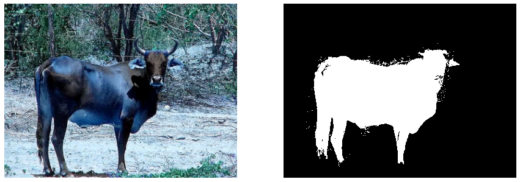
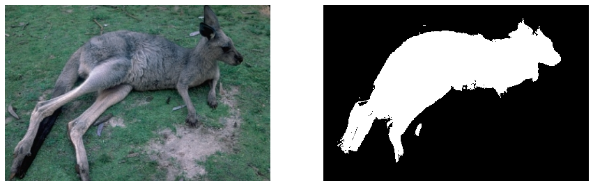
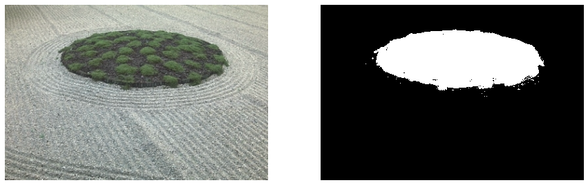

# Foreground-Segmentation
To achieve foreground segmentation, the system employs OpenCV GrabCut, Superpixel Methods, and CNN Based Object Detection techniques. #YOLO #Open-CV

# Introduction

- Image segmentation is the process of splitting a digital image into different subgroups (of pixels)
known as Image Objects, which may reduce the complexity of the image and therefore make
analyzing the image easier. The process of extracting the foreground from the image is called
Foreground Segmentation.

- The GrabCut algorithm is one of the simplest methods for extracting a foreground
object from an image because it requires the least amount of user interaction. In many
cases, the user had to input to draw a bounding box around the target object. If the
selection is not quite right, the user can provide more information by adding samples to
the foreground and background to get a better cut.

- Simple Linear Iterative Clustering is a superpixel segmentation algorithm that
requires little computational power. In a nutshell, the algorithm clusters pixels in a
five-dimensional colour and image plane space to produce compact, nearly uniform
superpixels efficiently. SLIC is a pixel clustering algorithm that can be used to replace a
pixel grid structure. They are frequently used in preprocessing steps to reduce the
complexity of subsequent image processing steps, as well as to extract features, which
is something we would like to do with superpixels

- You Only Look Once, or YOLO, was proposed as a real-time object detection technique.
It approaches image object detection as a regression problem involving spatially
separated bounding boxes and associated class probabilities. A single neural network
divides the image into regions and predicts bounding boxes and probabilities for each
region in this approach. In a single evaluation, the neural network predicts bounding
boxes and class probabilities directly from full images. There are pre-trained YOLO
network weights that can be used immediately in any implementation, eliminating the
need to train a model on example images.

# Algorithm

The input image is fed into the YOLO model, which detects objects and extracts their bounding
boxes. The GrabCut algorithm is then used to generate an initial mask, which is then fed back
into the GrabCut algorithm 10 times to converge the segmentation. The SLIC algorithm is then
used to segment the image into superpixels, with the desired number of superpixels set to 1000.
For most images, a thousand superpixels ensure that the superpixels keep separate the regions
meant for different labels without having to enforce connectivity. The output of the superpixel
algorithm labels each pixel with a value indicating which superpixel it belongs to. When we
apply the GrabCut mask to the superpixel representation of the image, we can see which
superpixels contain pixels that GrabCut has labelled as foreground. If the GrabCut mask
contains more than 75% of a superpixel's pixels, it is included in the foreground segmentation.
The set of superpixels that meet this criterion becomes the new foreground mask, and the
object is extracted for evaluation

# Result

* Input Image vs. Foreground Segmented Image

# Useful Resources

1. https://github.com/spmallick/learnopencv/blob/master/ObjectDetection-YOLO/object_det
2. http://gigl.scs.carleton.ca/node/1080
3. https://ee.cooper.edu/~keene/assets/rafi_thesis.pdf
